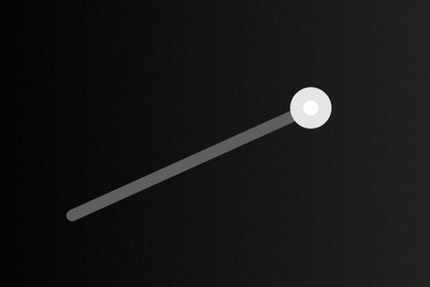
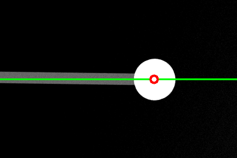

# Batch Image Enhancement, Alignment and Cropping

[](https://www.python.org/)
[](https://opencv.org/)
[](https://github.com/ZIZI0901/image-batch-enhance-rotate-crop/actions/workflows/python.yml)

中文文档: [README.zh-CN.md](README.zh-CN.md)

A reproducible image-preprocessing tool for batches of grayscale or color images. It enhances contrast, locates a bright reference region, estimates the dominant axis, aligns the image and crops a configurable region around the detected center.

The project provides a Tkinter desktop interface, a command-line interface and a reusable Python package.

## Demo

The following example is generated entirely from synthetic data and contains no private experimental images.

| Synthetic input | Aligned and cropped output |
|---|---|
|  |  |

Regenerate the images locally with:

```bash
python examples/generate_demo.py
```

## Processing pipeline

```text
Input image
  -> grayscale conversion
  -> brightness and contrast adjustment
  -> threshold-based bright-region detection
  -> weighted PCA dominant-axis estimation
  -> rotation around the detected center
  -> configurable center-aware crop
  -> output image and per-file result
```

## Features

- Batch processing for `.png`, `.jpg`, `.jpeg`, `.tif`, `.tiff` and `.bmp`
- Unicode paths, including Chinese file and folder names
- Optional brightness and contrast enhancement
- Bright connected-component selection by area rank
- Adaptive alignment through weighted principal-axis estimation
- Fixed-angle rotation for controlled experiments
- Center-aware cropping with adjustable crop size and horizontal placement
- Per-file success/failure reporting without stopping the entire batch
- Desktop GUI, CLI and importable Python API
- Automated tests on Windows through GitHub Actions

## Installation

Python 3.9 or later is required.

```bash
git clone https://github.com/ZIZI0901/image-batch-enhance-rotate-crop.git
cd image-batch-enhance-rotate-crop
python -m venv .venv
```

Windows PowerShell:

```powershell
.\.venv\Scripts\Activate.ps1
python -m pip install -e .
```

macOS/Linux:

```bash
source .venv/bin/activate
python -m pip install -e .
```

## Quick start

### Desktop interface

```bash
python run_gui.py
```

After installation, the GUI is also available as:

```bash
image-batch-process-gui
```

### Command line

```bash
image-batch-process "path/to/input" "path/to/output" \
  --spot-threshold 180 \
  --line-threshold 55 \
  --crop-scale 0.55 \
  --crop-proportion 0.65
```

The CLI returns exit code `0` when every file succeeds, `1` when individual files fail and `2` for invalid input or configuration.

Useful options:

| Option | Meaning | Default |
|---|---|---:|
| `--no-enhance` | Disable brightness/contrast enhancement | off |
| `--no-rotate` | Disable alignment | off |
| `--no-crop` | Disable cropping | off |
| `--brightness` | Brightness multiplier | `1.2` |
| `--contrast` | Contrast multiplier | `1.5` |
| `--center-number` | Bright component rank used as center | `1` |
| `--fixed-angle` | Rotate by a fixed angle in degrees | adaptive |
| `--spot-threshold` | Initial threshold for bright-region detection | `16` |
| `--line-threshold` | Threshold for dominant-axis estimation | `16` |
| `--crop-proportion` | Horizontal center position inside crop | `0.5` |
| `--crop-scale` | Crop width/height relative to original | `0.5` |
| `--no-reference` | Do not draw center and reference line | off |

Cropping depends on a detected rotation center, so `--no-rotate` must be combined with `--no-crop`.

## Python API

```python
from image_batch_enhance_rotate_crop.processor import ProcessingOptions, process_folder

options = ProcessingOptions(
    brightness_factor=1.15,
    contrast_factor=1.35,
    spot_threshold=180,
    line_threshold=55,
    crop_scale=0.55,
    crop_proportion=0.65,
    draw_rotation_reference=False,
)

results = process_folder("input", "output", options)
for result in results:
    print(result.filename, result.success, result.message)
```

## Algorithm notes

1. The selected bright component is converted to a center point using its contour mean.
2. Pixels on the configured side of that center are collected from the thresholded foreground.
3. A distance-weighted covariance matrix is computed and its principal eigenvector defines the dominant axis.
4. The image is rotated around the detected center, preserving the original canvas size.
5. Cropping keeps the detected point at a configurable horizontal position, which is useful when the region of interest is asymmetric.

This method is deterministic and interpretable, but it is not intended as a universal image-registration algorithm.

## Limitations

- Detection assumes that the reference region is brighter than its surroundings.
- Thresholds should be calibrated on representative samples before batch processing.
- Strong clutter or multiple similarly sized bright regions can select the wrong center.
- Rotation keeps the original canvas and may clip content close to image boundaries.
- The current crop is axis-aligned and depends on successful center detection.

## Development

Install development dependencies and run the tests:

```bash
python -m pip install -e ".[dev]"
python -m pytest
```

The synthetic README assets are reproducible:

```bash
python examples/generate_demo.py
```

## Project structure

```text
.
├── .github/workflows/python.yml
├── examples/
│   ├── assets/
│   └── generate_demo.py
├── src/image_batch_enhance_rotate_crop/
│   ├── cli.py
│   ├── cropping.py
│   ├── enhancement.py
│   ├── processor.py
│   ├── rotation.py
│   └── ui.py
├── tests/test_processing.py
├── pyproject.toml
└── run_gui.py
```

## Data and privacy

No private experimental data is included. The screenshots in this repository are generated from synthetic images. Users should confirm that they have permission before processing or publishing third-party image data.
